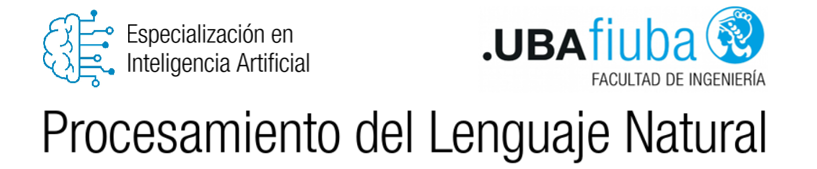
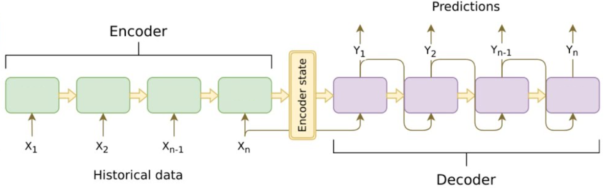

# Desafíos de Procesamiento de Lenguaje Natural (NLP) - Especialización en Inteligencia Artificial (FIUBA)

**Autor:** Karen Raczkowski

En el transcurso de la materia, se llevaron a cabo una serie de trabajos prácticos que abarcaron diversas áreas del Procesamiento de Lenguaje Natural (NLP). En este repositorio se encuentran los temas vinculados a la materia, así como las soluciones a los ejercicios propuestos en diferentes etapas del curso.

## Desafío 1: Vectorización

En este primer desafío, nos adentramos en el mundo de la vectorización de texto. Aprendimos a representar palabras y textos en formatos numéricos, lo que nos permitió:

- **Obtener un vocabulario del corpus.**
- **Realizar One-Hot Encoding:** Convertir textos en matrices binarias.
- **Generar matrices de frecuencia de palabras.**
- **Crear matrices TF-IDF:** Comprender la relevancia de las palabras en documentos.
- **Comparar documentos:** Utilizando la similitud coseno.

## Desafío 2: Bot con NLTK

El segundo desafío nos sumergió en la construcción de un bot de obtención de información utilizando NLTK. A través de este desafío, logramos crear un bot capaz de extraer información utilizando un corpus de Wikipedia sobre Argentina.

## Desafío 3: Embeddings

Utilizando Gensim y el libro "Game of Thrones", conseguimos:

- **Obtención del corpus:** Recopilamos y procesamos el texto completo del libro "A Game of Thrones" (primera entrega de la serie "A Song of Ice and Fire") para su posterior análisis.
- **Creación de vectores de palabras:** Utilizamos Gensim para generar vectores de palabras que representan términos y conceptos presentes en el libro.
- **Análisis de términos:** Exploramos términos específicos presentes en el libro y examinamos sus representaciones vectoriales.
- **Explicación de similitudes:** Comparamos vectores de palabras para identificar similitudes semánticas entre términos y conceptos en el espacio de embeddings.

## Desafío 4: RNN - Predicción de la próxima palabra

El siguiente desafío se exploran las Redes Neuronales Recurrentes (RNN) aplicadas a la predicción de palabras en un contexto dado. En este caso, se utilizó un dataset que contiene diálogos de Los Simpson.

- **Preprocesamiento de datos:** Se realizó la conversión de oraciones a secuencias de tokens y se ajustó su tamaño para alimentar el modelo.
- **Modelado y rendimiento:** El modelo se entrenó y validó para evaluar su precisión en la tarea de predicción de palabras.

- **Conclusiones:** El análisis del rendimiento del modelo sugiere la necesidad de mejorar la generalización para prevenir el sobreajuste. Se propone explorar técnicas adicionales para optimizar la precisión en datos no vistos.

## Desafío 5: Sentiment Analysis con Embeddings + LSTM

El ejercicio se centra en el análisis de sentimientos a partir de críticas de compradores de ropa. El sistema está diseñado para determinar automáticamente la evaluación del comprador, traducida en una puntuación de estrellas para el producto, basándose en el contenido textual de sus críticas. Construimos y entrenamos un modelo secuencial que utiliza:

* Capas de Embedding para generar representaciones vectoriales de las palabras.
* Capas LSTM para capturar las dependencias a largo plazo en los datos de texto.
* Una estructura que incluye capas de Dropout para mitigar el sobreajuste.

## Desafío 6: LSTM Bot QA

Este ejercicio se enfoca en desarrollar un Bot de Respuesta Automática (QA) basado en redes LSTM. El objetivo es crear un bot que interactúe en inglés, basándose en datos del desafío ConvAI2. 

